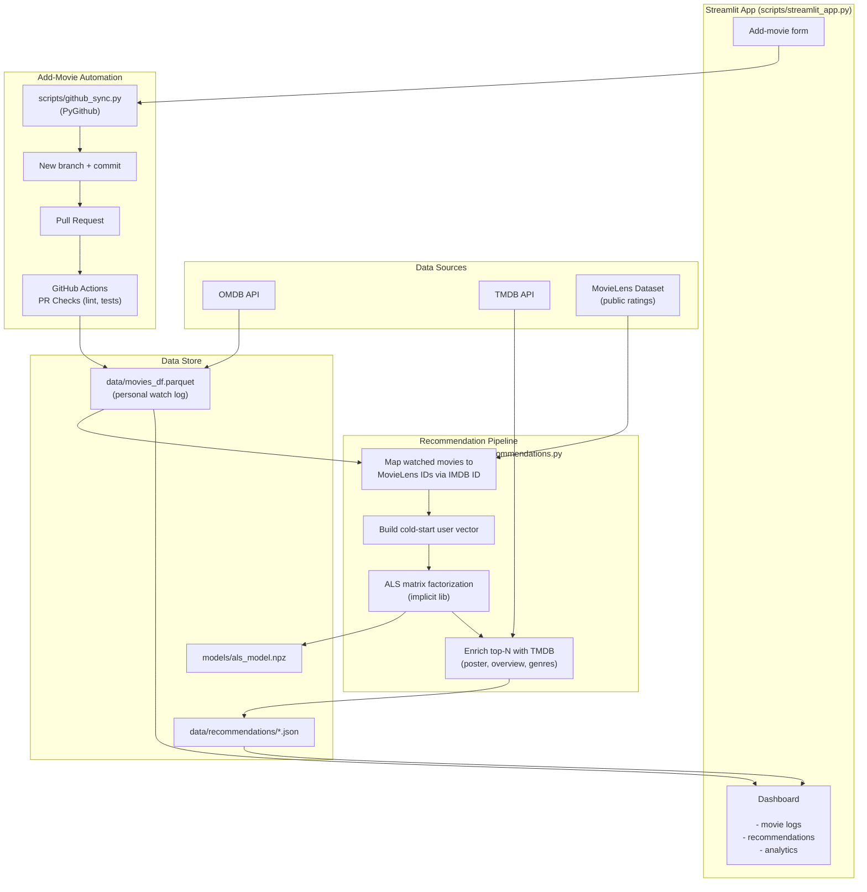

# Pet project: Movies dashboard

Online dashboard [(kburkin-movie-list.streamlit.app)](https://kburkin-movie-list.streamlit.app/) with detailed log of movies that I have seen and generated personal recommendations tuned to my tastes. In the lower section of the dashboard you can find curious statistics about them.

## Data sources
- Initially, I used the movies list, that I kept over years. The last version of that list was published on [google spreadsheets](https://docs.google.com/spreadsheets/d/1zDdGrNWN3QnSgB_7Tj-hoDe1mEKkivMk/edit?usp=sharing&ouid=106349676610417203719&rtpof=true&sd=true) until I moved the logs here.
- I obtain additional movie credentials from [omdbapi.com](https://www.omdbapi.com/).
- For recommending system I used  [MovieLens Dataset](https://grouplens.org/datasets/movielens/) - Free dataset with millions of ratings

## Features

### 🎬 Movie Tracking
- Detailed log of watched movies with ratings and metadata
- Integration with OMDB and TMDB APIs for enriched movie data
- Interactive dashboard with statistics and analytics

### 🤖 AI-Powered Recommendations
- **Collaborative filtering** recommendation system
- Analyzes your last 6 months of viewing history
- Generates 5 personalized movie recommendations

## Technical Details

### Architecture

### Recommendation Engine

The system treats my logs as a user against the public [MovieLens dataset](https://grouplens.org/datasets/movielens/):

1. Watched movies (`data/movies_df.parquet`) are mapped to MovieLens `movieId`s via IMDB ID.
2. A sparse confidence vector is built from your ratings (`liked` → implicit rating).
3. An **ALS (Alternating Least Squares)** model, pretrained on MovieLens via the [`implicit`](https://github.com/benfred/implicit) library, scores candidate movies for that vector.
4. The top-N results are enriched with poster, overview and genre data from TMDB before being saved to `data/recommendations/`.

Retraining runs on a schedule (`scripts/scheduled_retrain.sh`) so recommendations stay fresh as new movies are logged.

### Adding Movies via the App

The Streamlit dashboard includes a password-protected "add movie" form. Submitting it:
1. Calls `scripts/github_sync.py` (PyGithub) to commit the updated `movies_df.parquet` to a new branch.
2. Opens a pull request against `main`.
3. GitHub Actions (`.github/workflows/pr-checks.yml`) lints (`flake8`/`isort`) and runs the test suite (`pytest`) on the PR.
4. Once merged, Streamlit Cloud redeploys automatically with the new data.

### Tech Stack

| Layer | Technology |
|-------|-----------|
| Data processing | Polars, Pandas |
| Recommendation model | `implicit` (ALS), scikit-learn |
| APIs | OMDB, TMDB |
| Dashboard | Streamlit, Plotly |
| Git automation | PyGithub |
| CI | GitHub Actions (flake8, isort, pytest) |
| Package management | Poetry |